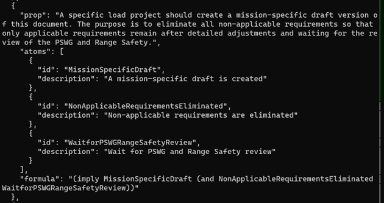
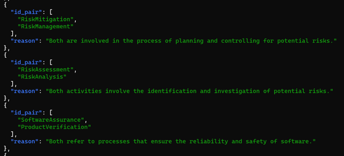
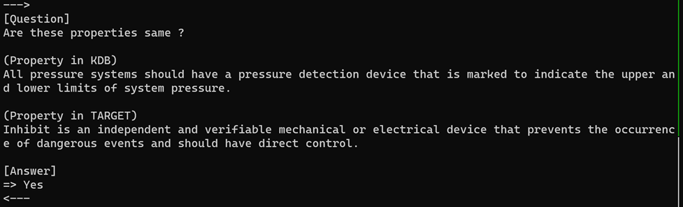

# Document management with formal and independent knowledge representatio
## High-Level Summary

There are numerous documents pertaining to standards in space development. Moreover, the content of these documents occasionally undergoes additions, deletions, or modifications. Due to this, there might be omissions or contradictions in the recommended practices across different documents. In the context of space development, even minor errors can potentially lead to major accidents. Therefore, it is crucial to address these omissions and contradictions to ensure safer space development. As a specific example, NASA has over 80 development standard documents, each containing dozens to over a hundred pages of information. It is extremely challenging to manually detect inconsistencies or omissions within such a vast amount of documents. To address this, we propose a method to efficiently extract the recommended practices from the documents and organize and manage them using a formal approach. Specifically, we will extract information from PDF format documents and represent it formally using logical expressions. By using this formal approach, we can clearly pinpoint contradictions or insufficiencies between documents, ensuring consistency across them.

## Project Details
### Backgorund
There exists a multitude of documents related to standards in space development. These documents intricately detail recommended practices. However, given that these documents are periodically updated, maintaining consistent information can be challenging. For instance, just considering NASA's development standards (https://standards.nasa.gov/all-standards), there are over 80 distinct documents, with a single one sometimes spanning from tens to hundreds of pages. Furthermore, newly acquired insights are often documented in different locations, leading to an even greater volume of documents.
In such a complex environment, there's an increased risk of applying outdated or incorrect development standards. In the realm of space development, even minor oversights can lead to significant accidents. Hence, it's crucial to prevent these issues. It is of utmost importance to ensure that all information across documents is accurate, up-to-date, and free from inconsistencies and omissions.

### Challenge
In recent years, the advancement of AI has been remarkable. Particularly, models like the GPT and other LLMs can now process abstract commands through natural language. As a result, leveraging AI for document management is becoming a viable approach. One strategy is to have LLMs read extensive amounts of text to construct a super-assistant equipped with comprehensive knowledge.
However, there are two significant challenges when using AI for document management:

1. Comprehensiveness Issue
2. Protection of Confidential Information

#### Comprehensiveness Issue
AI has the capability to detect subtle differences in texts and identify simple contradictions, even explaining the reasons behind them. However, since AI operates on computational platforms, its computational capacity has limits. When feeding vast amounts of text and issuing complex commands, AI might abandon computations midway. This makes it challenging to determine if AI's observations are indeed exhaustive. This issue is particularly problematic in fields like space development where safety is paramount.

#### Protection of Confidential Information
Space development is intertwined with national security, and not all documents related to it are public. Feeding these documents into LLMs means the models store this information internally. There's a high chance that such content may contain classified information. Hence, there's a risk of LLMs unintentionally revealing this sensitive data. Currently, there's no established method to completely eliminate this risk.

### Approach
There exists an approach to create a super-assistant by having LLMs read vast amounts of text. However, this method comes with the two previously mentioned challenges. Consequently, I opt not to adopt the direct approach of feeding development standard documents to the LLM. Instead, I propose two alternative strategies:
1. Formalization of Knowledge
2. Independent Management of Knowledge

#### Formalization of Knowledge
Rather than managing knowledge in natural language, we should formally represent it using logical expressions, such as propositional logic, linear temporal logic (LTL), or computational tree logic (CTL). By employing this formal representation, we can precisely identify gaps or inconsistencies in our knowledge base. Specifically, when using propositional logic, tools like SAT solvers can be utilized for knowledge analysis. Most importantly, through this formalization, we can ensure exhaustive examination of issues. Even if a complete search isn't feasible, we can confidently ascertain that the results are not exhaustive.

#### Independent Management of Knowledge
Instead of storing the formalized knowledge within the LLM's internal model, we should manage it independently, separate from the model. Operations on this independent knowledge are then conducted externally from the LLM model. By adopting this method, we eliminate the risk of storing confidential information within the LLM, enabling its use without concerns of potential information leaks.

### Implementation
#### Knowledge Extraction
Input the document in PDF format. Using LLM, extract recommendations and requirements stated in the document. For the actual prompt used, please check the source code on GitHub at https://github.com/mhorii/NASASpaceAppsChallenge2023_public/blob/master/src/doc2knowledge.py (Sorry it's in Japanese...).

Using LLM, the following knowledge was extracted. The actual output can be found at https://github.com/mhorii/NASASpaceAppsChallenge2023_public/tree/master/src/knowledge. Since the output was in Japanese, the output below has been translated from Japanese to English:

* "Design burst pressure refers to the calculated pressure that a component should withstand during qualification tests without rupturing or bursting. This value is a recognized figure calculated in an industry and/or government accepted method to determine design pressure."
* "Pressure vessel and system testing should be conducted as a hydrostatic test, which involves filling the vessel or system with a liquid (usually water) and applying pressure up to a specified level."
* "To ensure safety and prevent propagating explosive effects to other elements, fuses must have an interrupt mechanism."

#### Knowledge Formalization

Using LLM, we convert the knowledge extracted in natural language into a formal representation. Here, we express propositional logic formulas in S-expression ("formula"). Also, atomic terms contained in the propositional logic formula are stored ("atoms").

The knowledge mentioned above can be interpreted as: If it's "MissionSpecificDraft", then it's "NonApplicableRequirementsEliminated" and "WaitforPSWGRangeSafetyReview".

#### Document Review

There are two approaches:

* Bottom-up Approach
* Top-down Approach

The "Bottom-up approach" approaches potential knowledge (propositions) by examining atomic terms. The "Top-down approach" approaches potential atomic terms by examining knowledge (propositions).

In the Bottom-up Approach, knowledge obtained from another document is referenced, and potential atomic terms are extracted using natural language processing or AI. Subsequently, the user is asked whether the extracted atomic terms holds. If they do, the description related to those atomic terms should be added to the document.

The figure above compares the content of atomic terms that hold in another document (id_pair[0]) with those validated in the document under review (id_pair[1]). If the contents of id_pair[0] and id_pair[1] are determined to be the same, then the knowledge related to id_pair[0], extracted from another document, may also hold in the document under review. Therefore, to investigate whether such knowledge is valid, we transition to the Top-down approach.

In the Top-down approach, you ask the user to confirm whether a certain knowledge (proposition) holds true. If that knowledge holds, the description related to that knowledge should be added to the document. Furthermore, if that knowledge holds, it implies that other knowledge with the same meaning also holds true.

The diagram above compares the meaning of knowledge obtained from another document (KDB: Knowledge Data Base) with the knowledge holds in the review target document (TARGET). If the knowledge that holds in TARGET has the same meaning as the knowledge that holds in KDB, it becomes possible to decompose KDB. In other words, by formally representing knowledge, decomposition of knowledge is enabled. When certain knowledge is established, you can verify whether the atomic terms that compose it might also hold. If potential atomic terms are identified, their validity can be confirmed by querying the user. This leads to transitioning to the Bottom-up approach. Thus, there's potential to oscillate between these two approaches. Especially, since we used propositional logic formulas this time, SAT solvers like Z3 might be useful.

### Conclusion

We have proposed a new document management method that manages and manipulates knowledge outside of the LLM. This allows for comprehensive knowledge checks and addresses potential leaks of confidential information.

While we used propositional logic this time, it might also be possible to use logics like computation tree logic or linear temporal logic. In such cases, by modeling the specification using AI (for instance, through Kripke structures), you can verify whether the specification meets the recommended requirements. If that becomes possible, the verification will be between the document and its implementation to ensure recommended requirements are met, rather than just between documents. Generally, formal methods are costly to apply, but I believe that by using LLM, costs can be reduced and a future where formal methods are easily utilized will come.
